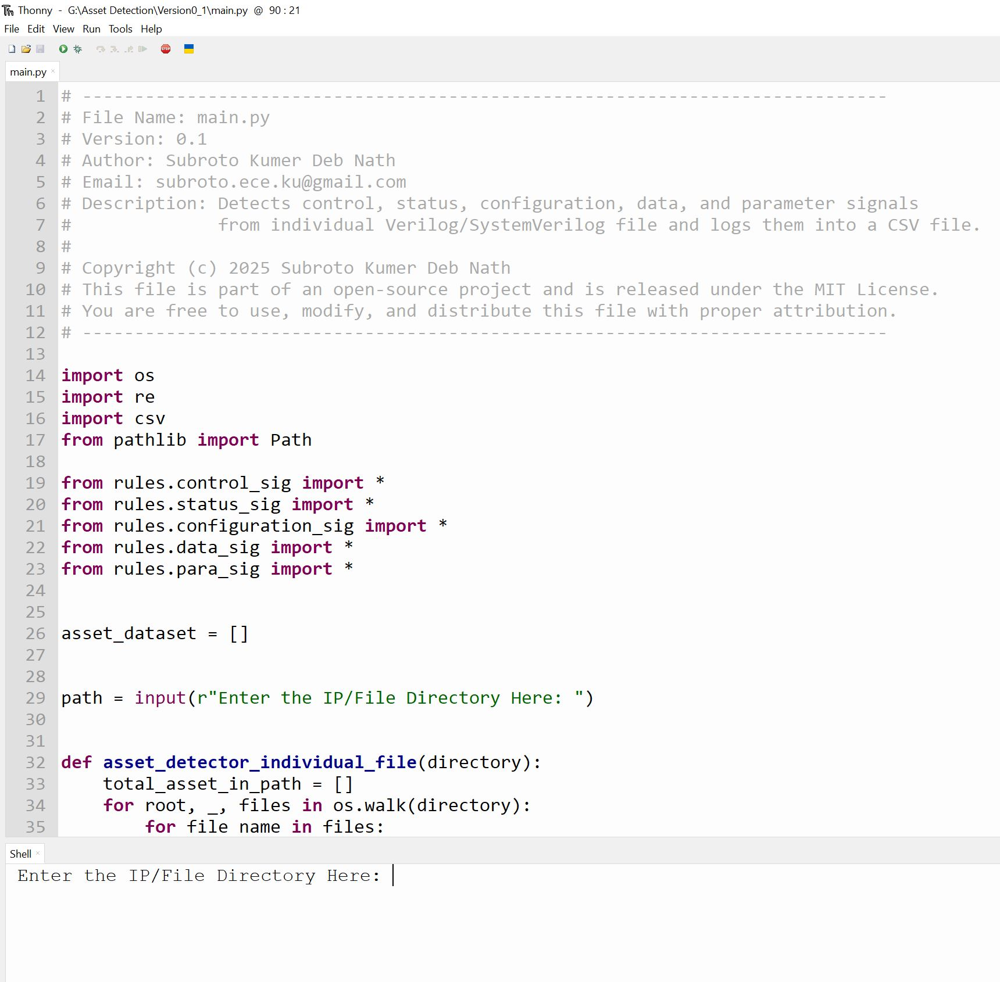
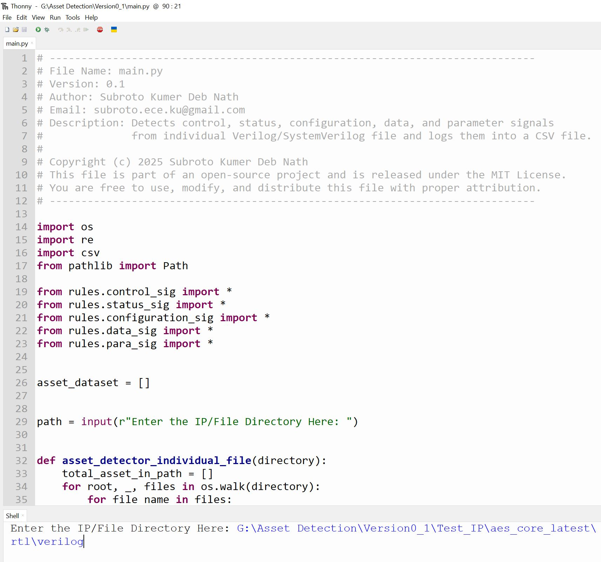
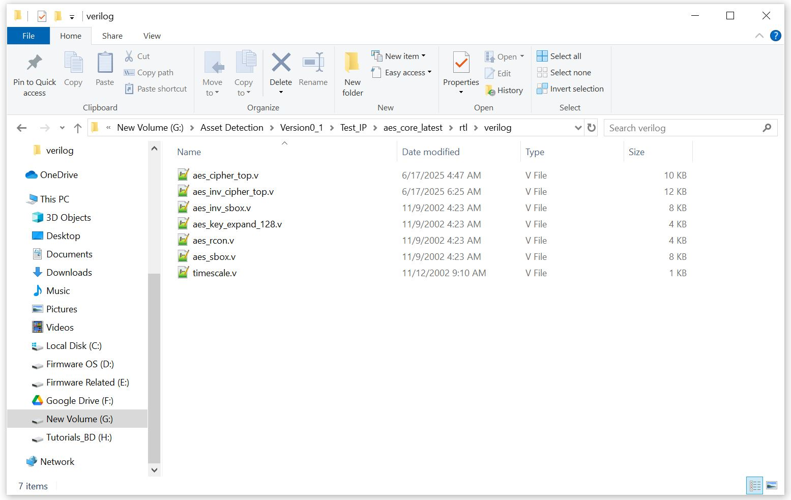
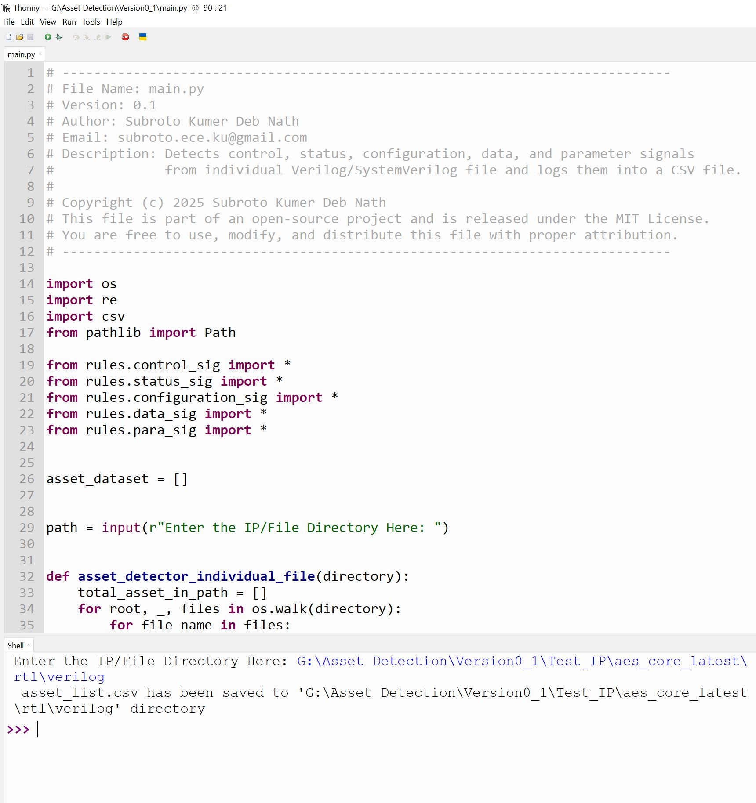
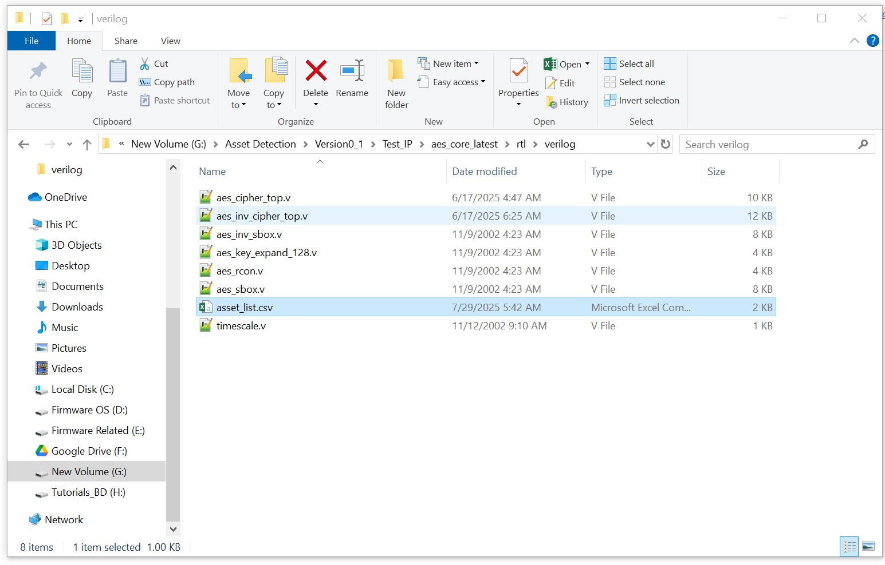
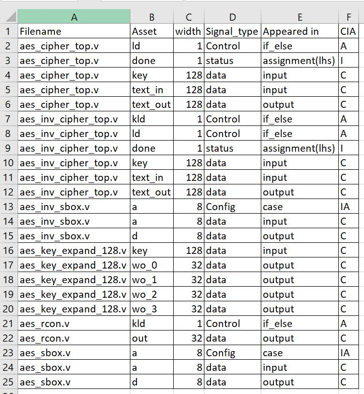

# 🛠️ Behavioral-Based Automatic Asset Detection Tool (v0.1)

This tool statically analyzes individual Verilog/SystemVerilog files to **automatically detect potential hardware security assets** based on behavioral patterns. It outputs the findings into a structured CSV file, aiding hardware security verification and design auditing processes.


## 🚀 1. Getting Started

### ✅ Step 1: Run the Tool

Start the tool by executing the `main.py` script:

```bash
python main.py

```

---


### ✅ Step 2: Enter Directory Path

The script will prompt:

`Enter the IP/File Directory Here:`



### ✅ Step 3: Submit the Path

Paste an IP or File directory path and hit `Enter`.
(I have uploaded an example IP for testing; in this case, I used the example IP directory. You can use your own.)




### ✅ Step 4: File Access

The tool scans all `.sv` and `.v` files in the specified folder.



### ✅ Step 5: CSV Generation

A new file named `asset_list.csv` is generated in the same folder.



### ✅ Step 6: Locate the CSV

The generated `asset_list.csv` appears in the provided directory.




## 📊 2. View CSV Content

The CSV contains the following columns:

| Column        | Description                                           |
|---------------|-------------------------------------------------------|
| `Filename`     | Name of the RTL file containing the asset            |
| `Asset`        | Name of the detected asset signal                    |
| `width`        | Bit-width of the signal                              |
| `Signal_type`  | Behavioral Type of signal                            |
| `Appeared_in`  | Part or block where the asset appears                |
| `CIA`          | Security tag: Confidentiality, Integrity, Availability |




## 📁 3.  Example Directory Structure
### Test_IP\aes_core_latest\rtl\verilog/
### ├── aes_cipher_top.v
### ├── aes_inv_cipher_top.v
### ├── aes_inv_sbox.v
### ├── aes_sbox.v
### ├── aes_rcon.v
### ├── aes_key_expand_128.v
### ├── timescale.v
### └── asset_list.csv ← (generated)

## 📦 4. Dependencies

- **Python version**: 3.11
- **Standard libraries used**:
  - `os`
  - `re`
  - `pathlib`

> ✅ No third-party libraries required.


## 📌 5.  Notes

- Version: `v0.1`
- Supports **single-file-based analysis**
- Designed for use in early-stage RTL hardware security workflows


## 📄 6. License

This project is licensed under the MIT License.  
See the [LICENSE](LICENSE) file for details.


## 🤝 7. Contributions

Feedback, suggestions, and pull requests are welcome!  
Let's make RTL security automation better—together.
